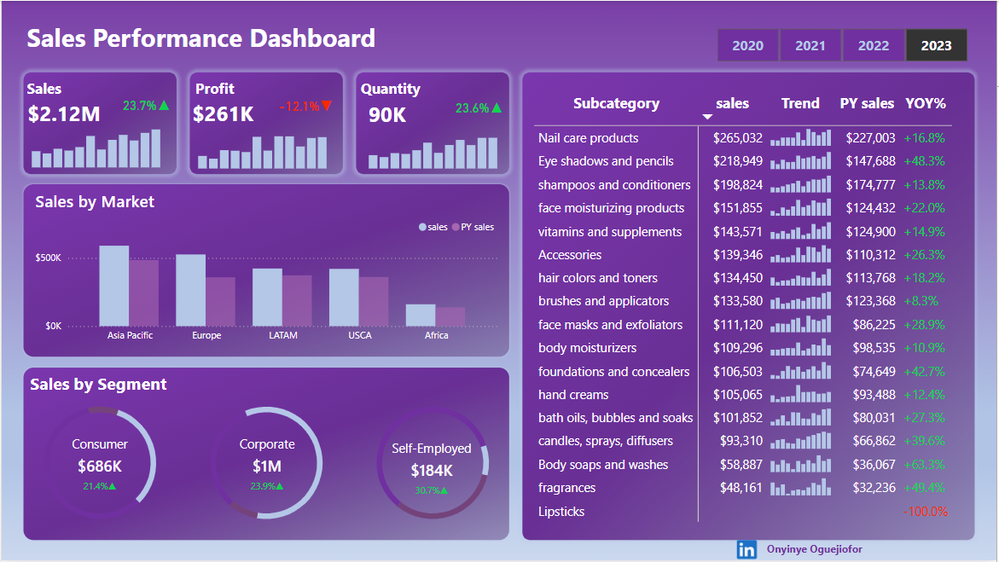

# Sales-Performance-Dashboard

## Table of Content

- [Project Overview](#Project-Overview)
- [Dataset Info](#Dataset-Info)
- [Tools Used](#Tools-Used)
- [Analysis Objectives](#Analysis-Objectives)
- [Results](#Results)
- [Visualizations Used](#Visualizations-Used)
- [Limitations](#Limitations)
- [Recommendations](#Recommendations)
- [Conclusion](#Conclusion)

### Project Overview
The goal of this project is to analyze and visualize sales data to understand market trends, segment performance, and product-level growth. 

### Dataset Info
The dataset contains 36,095 loan records with details such as:

- Bank Name
- Loan Status (Approved, Defaulted, Paid Off, Rejected)
- Customer Employment Type
- Loan Amount & Amount Paid
- Interest Rate
- State & Loan Purpose
- Loan Term (in years)

### Tools Used
Power BI – For data visualization and dashboard design

Microsoft Excel – For initial data preparation

Power Point – Gradient purple tones with white font for clean, modern UI

### Analysis Objectives
Identitfy the major kpi's, Sales Progit and quantity

Identify top-performing markets, segments, and subcategories

Highlight YOY growth trends across products

Evaluate segment contributions to overall revenue

### Results
Total Sales: $2.12M (+23.7%)

Total Profit: $261K (-12.1%)

Total Quantity Sold: 90K units (+23.6%)

Top Market: Asia Pacific

Top Segment: Corporate ($1M, +23.9%)

Best Performing Subcategory: Eye Shadows and Pencils (+48.3% YOY)

Underperformer: Lipsticks (-100% YOY)

### Visualizations Used
KPI Cards (Sales, Profit, Quantity)

Clustered Bar Charts (Market and Segment Analysis)

Trend Lines (Year-over-Year comparisons)

Column Chart with conditional coloring (Subcategory Sales YOY)

Donut Charts (Segment Breakdown)

### Limitations
- Profit decline not broken down by cause (e.g., discounts, returns, operational costs)

### Recommendations
Investigate profit decline causes despite sales growth

Explore potential of expanding into underperforming regions like Africa

Reassess marketing or product strategy for Lipsticks

Focus investment on fast-growing subcategories with high returns (e.g., Eye Shadows, Face Moisturizers)

### Conclusion
This dashboard provides actionable insights into the sales and growth performance across multiple dimensions. It can serve as a strategic decision-support tool for sales, marketing, and product teams.

